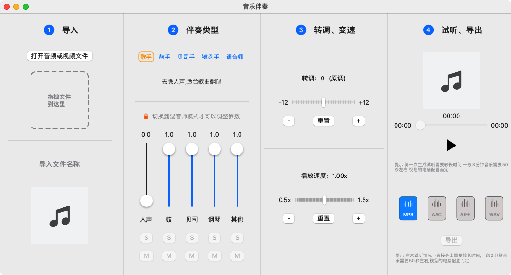
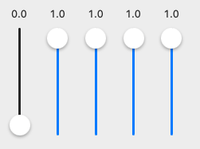
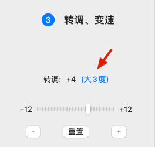
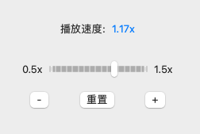
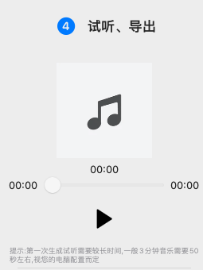
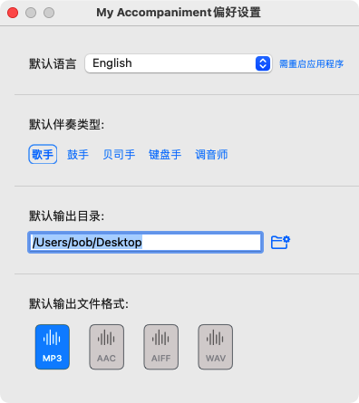

# 音乐伴奏 App

音乐伴奏 App是一款音乐伴奏制作辅助应用软件,可以对音乐文件或音乐视频文件进行AI深度分析,对音乐中的人声、鼓、贝司、钢琴及其他部分的音量比例进行自由组合,生成伴奏, 并同时可以对伴奏进行升调、降调以及播放速度进行调整.

## 使用入门

### 1、打开

点击 "打开音频或视频文件" 按钮或是直接拖拽文件到虚线方框内打开文件.

音频文件支持 **`mp3` `aac` `wav` `aiff` `m4a` `flac` `wma`**  格式 

视频文件支持  **`mov` `mp4` `avi` `m4v` `flv` `wmv` `mpg`** 格式 

### 2、伴奏类型

在"伴奏类型"中选择 "歌手","鼓手"等预置类型. 其中歌手,鼓手,贝司手及键盘手是最常用的预置类型.

如果您需要调整多个音轨,请切换到 "调音师"类型,**只有调音师类型是是可以自由调节各声部比例的**.

调音师类型中的各音轨音量是比例关系,从0.1到1.0,表示调整后的音量 = 原音量 x  比例, 比例从10%(0.1)到100%(1.0)

### 3、转调变速

#### 转调

转调是以十二平均律原理为基础的. 这里并不需要您对乐理有任何的了解. 对于普通用户来说转调主要是为升高或降低调以适合于自己的演唱或演奏. 您只需要尝试调整调的升高或降低,然后点击试听就可试着找到合适自己的调.

转调中主要是以音程作为单位

> 建议:一般 升降小3度范围内的调整对音乐的质量影响较小.

#### 变速

这里的变速是与原速度的比率, 并不是音乐中的每分钟多少拍.

速度调整的范围 从 0.5倍速 到 1.5 倍速, 之间可以以0.01倍速进行递增或递减.   

> 建议:0.85 -1.20 这个区间的速度调整对音乐质量的影响比较小.

### 4、试听、输出

#### 试听

* 打开文件后,第一次试听时间相对比较长一些,因为需要对文件进行分析.   一般3分钟左右时间的文件第一次生成试听大约需要30-50秒. 

* 后续的参数调整及试听则会快很多,一般在5秒之内.
* 如果您选择试听,下面的导出文件将会非常快.

#### 导出

* 导出文件格式支持 `mp3` `aac` `aiff` `wav` 默认导出格式为mp3,您也可以在**应用偏好设置**里选择其他格式作为默认导出格式.
* 导出每次提示用户选择目录 .  您也可以在**应用偏好设置**里设置默认导出目录. 设置后导出时则不会再提示您选择目录.

### 5、系统偏好设置

